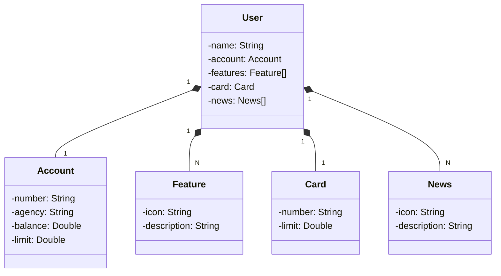

### Projeto desenvolvido durante realização do desafio de projeto "Publicando sua API REST na nuvem usando Spring Boot 3, Java 17 e Railway" do Santander Bootcamp 2023 - Fullstack Java+Angular.

Diagrama de classes da aplicação criado a partir do ChatGPT:
